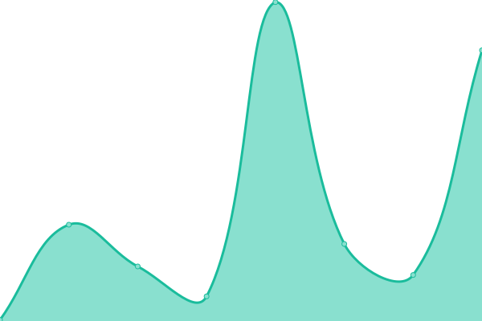

# [📈 Live Status](https://sherwin7.github.io/uptime_test): <!--live status--> **🟧 Partial outage**

<!--start: description--

**Upptime** (https://upptime.js.org) is the open-source uptime monitor and status page, powered entirely by GitHub Actions and Issues. It's made with 💚 by your friends at [Koj](https://koj.co).

<!--end: description-->

<!--start: status pages-->
<!-- This summary is generated by Upptime (https://github.com/upptime/upptime) -->
<!-- Do not edit this manually, your changes will be overwritten -->
<!-- prettier-ignore -->
| URL | Status | History | Response Time | Uptime |
| --- | ------ | ------- | ------------- | ------ |
|  [Google](https://www.google.com) | 🟩 Up | [google.yml](https://github.com/sherwin7/uptime_test/commits/master/history/google.yml) | 

 79ms
     
 | 

<a href="https://sherwin7.github.io/uptime_test/history/google">100.00%</a>
    

|  [Wikipedia](https://en.wikipedia.org) | 🟩 Up | [wikipedia.yml](https://github.com/sherwin7/uptime_test/commits/master/history/wikipedia.yml) | 

 125ms
     
 | 

<a href="https://sherwin7.github.io/uptime_test/history/wikipedia">100.00%</a>
    

|  Secret Site | 🟥 Down | [secret-site.yml](https://github.com/sherwin7/uptime_test/commits/master/history/secret-site.yml) | 

 0ms
     
 | 

<a href="https://sherwin7.github.io/uptime_test/history/secret-site">0.00%</a>
    

<!--end: status pages-->

[**Visit our status website →**](https://sherwin7.github.io/uptime_test)

## 📄 License

- Code: [MIT](./LICENSE) © [Sherwin P](sherwinp.me)
- Data in the `./history`
