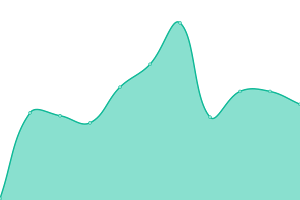
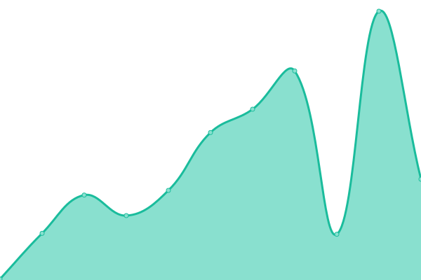

# [📈 Live Status](https://sherwin7.github.io/uptime_test): <!--live status--> **🟥 Complete outage**

<!--start: description--

**Upptime** (https://upptime.js.org) is the open-source uptime monitor and status page, powered entirely by GitHub Actions and Issues. It's made with 💚 by your friends at [Koj](https://koj.co).

<!--end: description-->

<!--start: status pages-->
<!-- This summary is generated by Upptime (https://github.com/upptime/upptime) -->
<!-- Do not edit this manually, your changes will be overwritten -->

| URL                                   | Status  | History                                                                                           | Response Time                                                                  | Uptime                                                                                                                                                                                                                            |
| ------------------------------------- | ------- | ------------------------------------------------------------------------------------------------- | ------------------------------------------------------------------------------ | --------------------------------------------------------------------------------------------------------------------------------------------------------------------------------------------------------------------------------- |
| [Google](https://www.google.com)      | 🟥 Down | [google.yml](https://github.com/sherwin7/uptime_test/commits/master/history/google.yml)           |  0ms      |            |
| [Wikipedia](https://en.wikipedia.org) | 🟥 Down | [wikipedia.yml](https://github.com/sherwin7/uptime_test/commits/master/history/wikipedia.yml)     |  0ms   |      |
| Secret Site                           | 🟥 Down | [secret-site.yml](https://github.com/sherwin7/uptime_test/commits/master/history/secret-site.yml) |  0ms |  |

<!--end: status pages-->

[**Visit our status website →**](https://sherwin7.github.io/uptime_test)

## 📄 License

- Code: [MIT](./LICENSE) © [Sherwin P](sherwinp.me)
- Data in the `./history` directory: [Open Database License](https://opendatacommons.org/licenses/odbl/1-0/)
